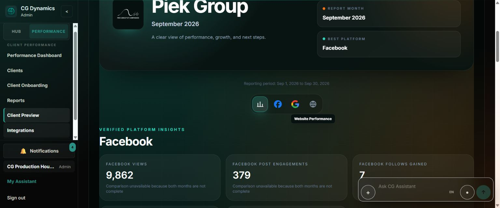
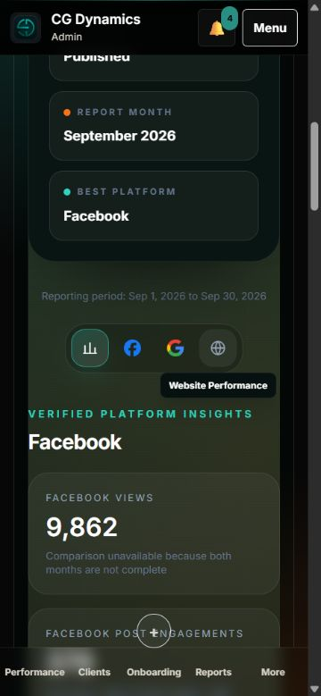
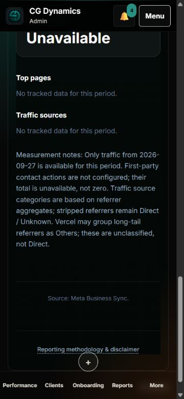
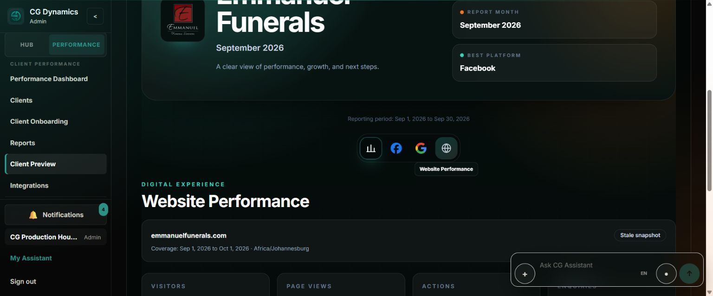
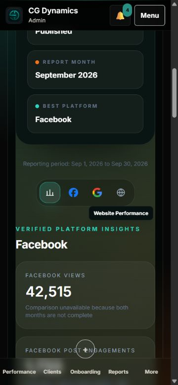
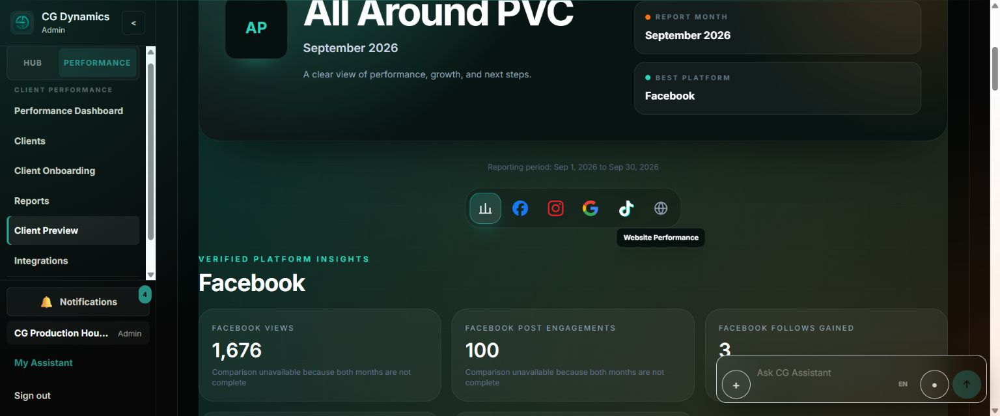
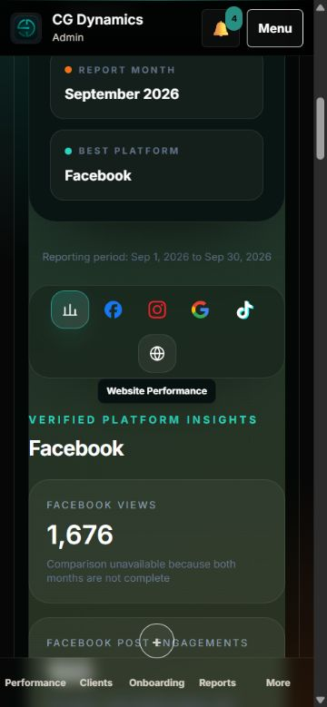
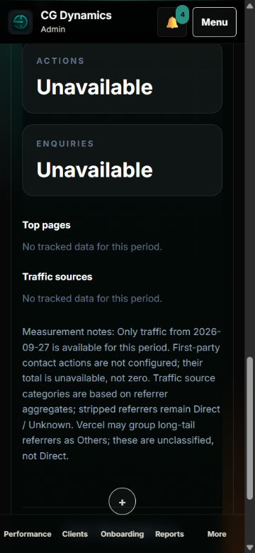
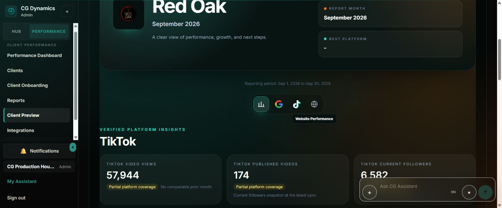
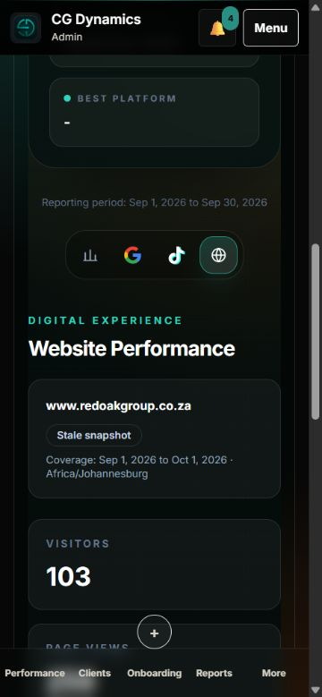

# #573 final authenticated browser acceptance — 1 October 2026

Read-only existing Chrome staff session, **CG Production House Admin**, at
`https://www.cgdynamics.co.za/admin/published`. Main baseline:
`ab53c2e020c7a495c96c6ebe1f173189c8fc7ce6` (PR #576 merged, Vercel SUCCESS).
September 2026 published report selected explicitly for each client.

| Client | Canonical host | Visitors / pageviews | Desktop | 375px |
| --- | --- | --- | --- | --- |
| Piek Group | www.piekgroup.co.za | 1 / 1 | PASS | PASS |
| Emmanuel Funerals | emmanuelfunerals.com | 1 / 1 | PASS | PASS |
| All Around PVC | www.allaroundpvc.co.za | 1 / 1 | PASS | PASS |
| Red Oak (unchanged reference) | www.redoakgroup.co.za | 103 / 258 | PASS | PASS |

## Exact evidence

- Three newly activated clients render the existing published September snapshots,
  not live provider calls or another client's metrics. Each Website tab changes to
  the exact selected client's canonical host.
- Coverage is `[Sep 1, Oct 1)` in Africa/Johannesburg; report header is inclusive
  Sep 1–Sep 30. Measurement note explicitly says only traffic from **2026-09-27**
  is available. Snapshot age now correctly renders **Stale snapshot**.
- Actions and enquiries show **Unavailable**, not zero. Notes explicitly state
  first-party contact actions are not configured and their total is unavailable,
  not zero. This agrees with previously verified `not_connected` / null persistence;
  the internal enum itself is deliberately not printed in client UI.
- Unsupported Top pages / Traffic sources show **No tracked data for this period**,
  with no fabricated rows/counts.
- Red Oak remains 103 visitors, 258 pageviews, 1 action, 0 enquiries; existing six
  top-page rows and five traffic-source rows remain. Notes preserve 18 Sep traffic
  coverage and 22 Sep contact collection start. No new snapshot was saved.
- Website regions contain no internal Website IDs, Dynamics UUIDs, provider URLs,
  bearer/token material or secrets. Staff-only shell/client selector is not presented
  as client-role isolation proof; published-only/RLS data proof remains the earlier
  activation evidence. This pass verifies Admin Client Preview's client-facing Website UI.
- Desktop innerWidth/body/document scrollWidth all **1536**. At innerWidth **375**,
  body/document scrollWidth both **360** (vertical scrollbar); no horizontal overflow
  for any of the four. Hosts, status and notes wrap; mobile nav remains visible.
- Captured tab error/warning logs are empty after all eight client/device checks.
  No broken loading/error state or runtime error observed. Temporary viewport reset.

## Screenshots

Final local rerun: Website boundary/readiness + Client Performance launch regressions
**17/17 pass**; `npm run build` (`tsc -b && vite build`) and `git diff --check` pass.
Scoped lint is not applicable to Markdown/JPEG-only changes. The existing bundle-size
advisory is unchanged. No application code changed. Prior activation verification was focused 20/20,
full suite 3,286/3,286, build/lint/diff green. Final acceptance is browser/DOM evidence,
not a new activation. No production data writes, syncs, snapshots, republishing,
Instagram activity, strategy changes, migrations, secrets or provider changes occurred.

#573 can close; no remaining #573 blocker.
